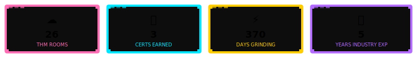

<!-- Intro -->

<div align="center">

# ⚗️ Chem Engineer → 🛡️🕵️ Xin Yi | Cyber Journey

> 👾 *Chemical Engineer turned Cybersecurity Learner.*
> Documenting my cybersecurity learning journey from fundamentals to field experience.

</div>

<!-- Intro -->



---

## 🗺️ Journey Timeline
```
[2021] ──✦── 🎓 B.Eng Chemical Engineering Graduate
[2022] ──✦── 💼🟢Internal Auditor at PETRONAS 
[2023] ──✦── 💡Discovered Cybersecurity
              └─ Started ISC² CC 📝
[2024] ──✦── Started TryHackMe
[2025] ──✦── Secured Cyber Risk Analyst job at Central Bank of Malaysia
                └─ GIAC GFACT 📝
                └─ GIAC GSEC (In Progress) 📝
[2026] ──✦── Information Security Specialist at British Petroleum 🎯
```

---

## 📁 Categories
- 🧠 [Beginner Rooms](https://github.com/woonxinyi/Cyber-Journey/blob/d1001cfc21ecceb49f492bab3773bd3b2fad90c9/README.md)
- 💥 [Offensive Security](#) Comming soon
- 🛡️ [Blue Team & SOC](#) Comming soon
- 📚 [Learning & Fundamentals](#)
- 💻 [CTFs & Challenges](#) Coming soon
- 
## ☁️ TryHackMe
[](https://tryhackme.com/p/xinyiwoon98)


## 📜 Certifications

| ✨ | Certificate | Issuer | Status | Verify |
|---|------------|--------|--------|--------|
| 🏆 | Google Cybersecurity | Coursera | 🔄 In Progress | -|
| 🔐 | ISC² CC | ISC² | ✅ Done | [Link](#) |
| ⚡ | CompTIA Security+ | CompTIA | 🔄 In Progress | — |
| 🌟 | [Next Cert] | — | 🔒 Locked | — |

---

<div align="center">
“Hack the planet... or die trying.” 😈🔥
</div>
